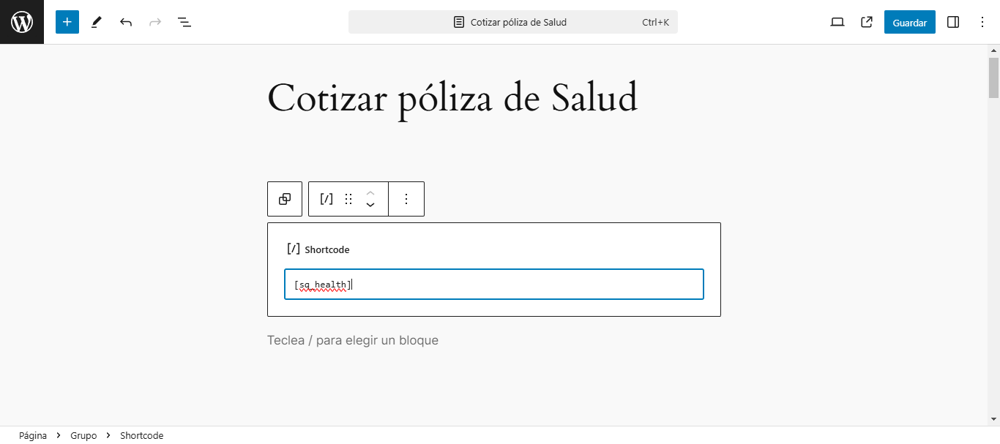
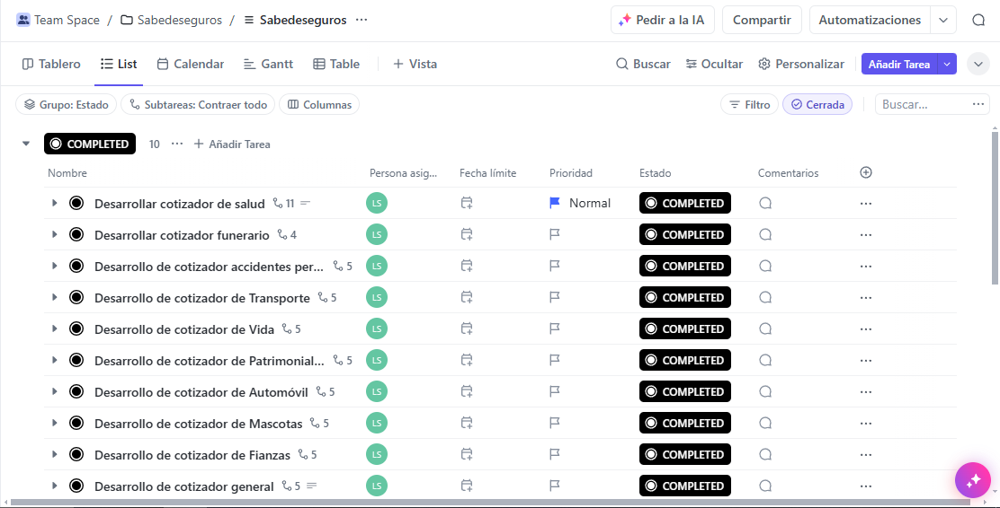

# Sabedese Quoters

Plugin personalizado de WordPress que permite utilizar cotizadores de pólizas de seguros para la página web de Sabe de Seguros, ofreciendo una API, desarrollada mediante la herramienta [WordPress REST API](https://developer.wordpress.org/rest-api/ "WordPress REST API"), para que sea utilizada en una aplicación desarrollada en Vue.js llamada [sabedeseguros-app](https://github.com/luisjose1010/sabedeseguros-app "sabedeseguros-app"), la cual ofrece la interfaz de usuario para el consumo de los datos y la visualización de los formularios dinámicos para cotizar las pólizas de seguros. El plugin agrega "shortcodes" para el uso de los cotizadores en cualquier lugar de la página web y gestiona su envío por correo electrónico.

## 💿 Instalación

Para que el plugin funcione correctamente se debe [activar el plugin](#1-activar-plugin "Activar plugin") en el editor administrativo del proyecto WordPress, [actualizar los permalinks](#2-actualizar-permalinks "Actualizar permalinks") del sitio, [agregar los datos](#3-insertar-tabla-wp81_sq_health-a-la-base-de-datos "Insertar tabla `wp81_sq_health` a la base de datos") necesarios a la base de datos y asegurarse de [incluir todo el contenido](#4-incluir-archivos-de-la-aplicación "Incluir archivos de la aplicación") de la carpeta `/dist` resultante al construir previamente para producción la aplicación [sabedeseguros-app](https://github.com/luisjose1010/sabedeseguros-app "sabedeseguros-app") dentro de la carpeta `/src/app`, con la conexión a la API debidamente configurada en el entorno de la App.

### 1. Activar plugin

1. Colocar el plugin dentro de la carpeta `/wp-content/plugins` del sitio WordPress
2. Ir al panel de administración del sitio WordPress
3. Ir al apartado `Plugins instalados` dentro de la sección `Plugins` en el menú lateral
4. Buscar el plugin `Sabedese Quoters` y darle click al botón `Activar

### 2. Actualizar permalinks

Es importante considerar que, para que la aplicación funcione correctamente, se debe refrescar los permalinks del sitio (hacer "flush"), esto es necesario para que las reglas de reescritura del plugin tengan efecto y la aplicación pueda acceder correctamente a todos sus archivos estáticos. Para ello:

1. Ir al panel de administración del sitio WordPress
2. Ir al apartado `Enlaces permanentes` dentro de la sección `Ajustes` en el menú lateral
3. Darle click al botón `Guardar cambios`, aunque no se haya realizado ningún cambio

### 3. Insertar tabla `wp81_sq_health` a la base de datos

Para que la API del plugin funcione correctamente se debe insertar la tabla `wp81_sq_health` y sus registros en la base de datos, es necesario ejecutar o importar el archivo `database/wp81_sq_health.sql` con la herramienta de preferencia. Por ejemplo, para importar el archivo SQL en la herramienta [`phpMyAdmin`](https://www.phpmyadmin.net/docs/ "phpMyAdmin") se debe seguir los siguientes pasos:

1. Iniciar sesión en la herramienta
2. Seleccionar con un click la base de datos que utiliza el sitio WordPress
3. Ir a la sección de `Importar` en la base de datos seleccionada
4. Seleccionar el archivo `wp81_sq_health.sql` (modificar si es necesario) y presionar el botón `Importar`

En el archivo se asume por defecto que el prefijo de las tablas es `wp81_`, de forma que ya se encuentra incluido en la creación de la tabla y la inserción de sus datos. Esto se puede modificar en las líneas 30, 31 y 48 del archivo en cuestión.

### 4. Incluir archivos de la aplicación

Para que los shortcodes accedan a los componentes de la aplicación, se deben copiar los archivos y directorios compilados de la carpeta `/dist`, resultantes de construir previamente la aplicación (building), para incluirlos dentro del directorio `/src/app` del plugin (solo el contenido, sin incluir la carpeta 'dist').

## Uso

Para utilizarse los cotizadores disponibles en el plugin solo debe colocar mediante el editor de WordPress el shortcode correspondiente a cada cotizador en la página, artículo o cualquier lugar donde se desee visualizar.

Por ejemplo:

### Cotizadores disponibles

- **[sq_all_quoters]** - Cotizador desplegable con todo el resto de cotizadores.
- **[sq_health]** - Cotizador para pólizas de salud.
- **[sq_funeral]** - Cotizador para pólizas funerarias.
- **[sq_accidents]** - Cotizador para pólizas de accidentes personales.
- **[sq_life]** - Cotizador para pólizas de vida.
- **[sq_transport]** - Cotizador para pólizas de vehículos.
- **[sq_car]** - Cotizador para pólizas patrimoniales.
- **[sq_patrimonial]** - Cotizador para pólizas de transporte.
- **[sq_surety]** - Cotizador para pólizas de fianzas.
- **[sq_pet]** - Cotizador para pólizas de mascotas.

## Gestión del proyecto

El proyecto se gestiona íntegramente mediante la plataforma de gestión [ClickUp](https://app.clickup.com/ "ClickUp") en este [enlace](https://app.clickup.com/9013166617/v/f/90131438783/90130724656 "Proyecto ClickUp de SabedeSeguros"). Para acceder al respectivo enlace con las tareas y la organización del proyecto, que complementan la documentación del mismo, es necesario poseer una cuenta con los permisos necesarios.

## ✨ Features

- [Aplicación Front-end (sabedeseguros-app)](https://github.com/luisjose1010/sabedeseguros-app "sabedeseguros-app")
- [WordPress](https://wordpress.org/documentation/ "WordPress")
- [WordPress REST API](https://developer.wordpress.org/rest-api/ "WordPress REST API")
- [PHP](https://www.php.net/docs.php "PHP")
- [MySQL](https://dev.mysql.com/doc/ "MySQL")
